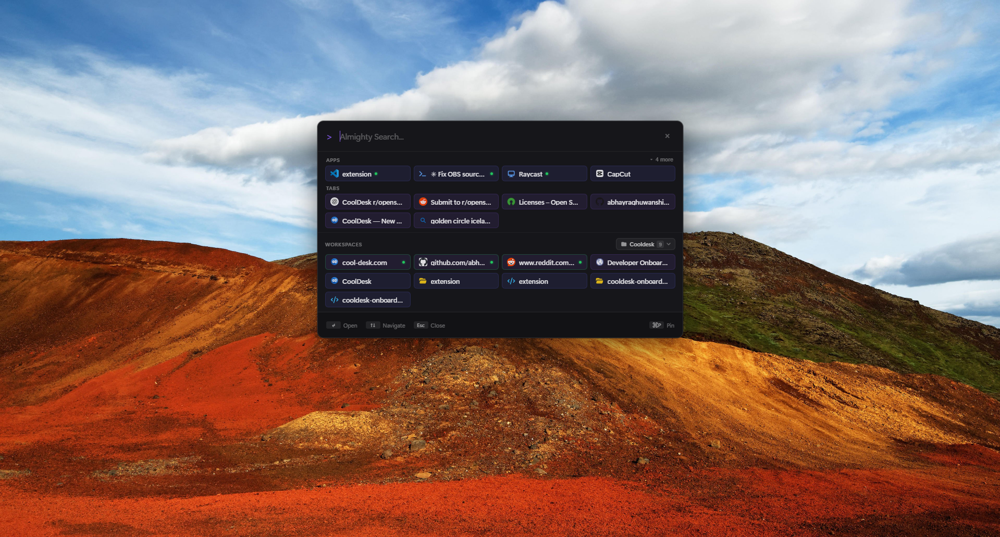
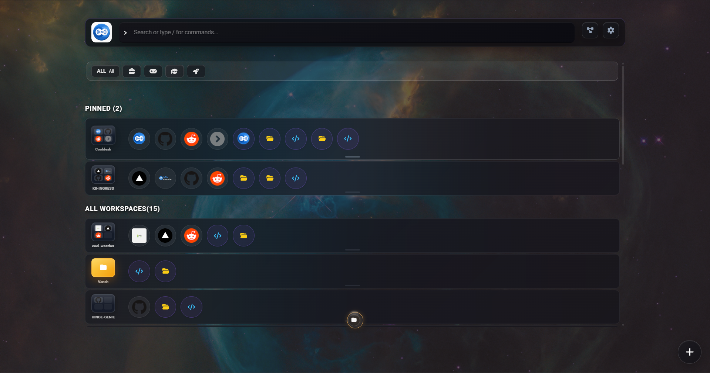
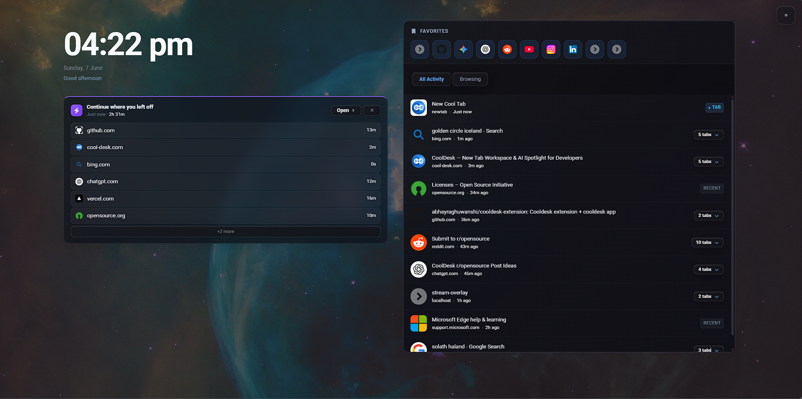
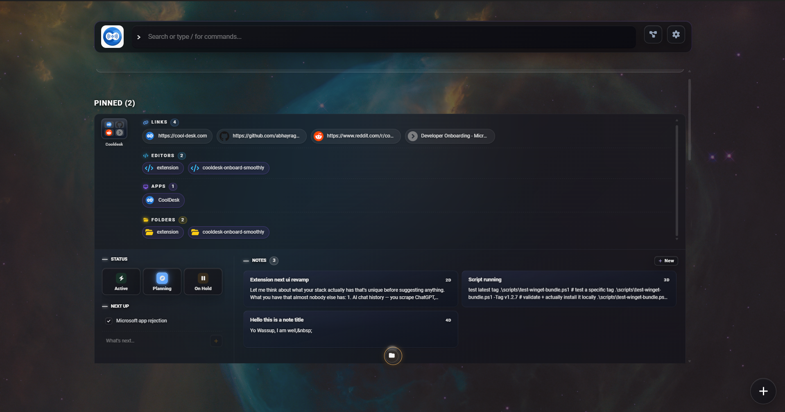
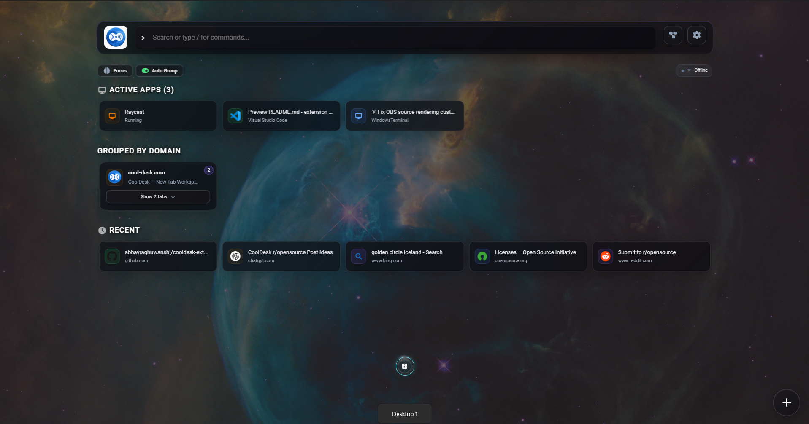
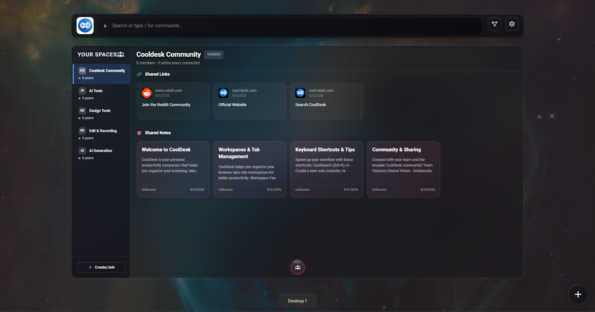

<div align="center">


# CoolDesk

**Turn scattered browsing into an organized productivity workspace.**

A desktop app (Tauri + React) paired with a Chrome extension that captures web
content, organizes it into workspaces, and gives you a fast spotlight search
across your apps, tabs, notes, history and bookmarks — all stored locally.

[](https://chromewebstore.google.com/detail/new-tab-by-cooldesk/ioggffobciopdddacpclplkeodllhjko)
[](https://learn.microsoft.com/windows/package-manager/)
[](https://github.com/abhayraghuwanshi/cooldesk-extension#macos)
[](./LICENSE)


**🧩 [Install "New Tab by CoolDesk" from the Chrome Web Store →](https://chromewebstore.google.com/detail/new-tab-by-cooldesk/ioggffobciopdddacpclplkeodllhjko)**

</div>

---

## ✨ Screenshots


| Spotlight search | Workspace view |
| :--------------: | :------------: |
|  |  |

| New tab dashboard | Note capture |
| :---------------: | :----------: |
|  |  |

| Active apps & windows | Share & sync |
| :-------------------: | :----------: |
|  |  |

---

## What it does

- **Spotlight search** — one keystroke to search across installed apps, open
  browser tabs, workspaces, history and bookmarks, with fuzzy matching.
- **Content capture** — select text on any page to save it into daily notes.
- **Workspaces** — group tabs, notes, todos and status by topic/project.
- **Tab management** — clean up, restore closed tabs, and track activity.
- **Local-first** — everything is stored on your device. No external servers
  required.

---

## Install

### Desktop app

**Windows** — install via [winget](https://learn.microsoft.com/windows/package-manager/):

```powershell
winget install CoolDesk.CoolDesk
```

<a name="macos"></a>
**macOS** (Apple Silicon) — install via [Homebrew](https://brew.sh):

```bash
brew tap abhayraghuwanshi/cooldesk https://github.com/abhayraghuwanshi/cooldesk-extension
brew install --cask cooldesk
```

To update later: `brew upgrade --cask cooldesk`.

**macOS / Linux (manual)** — download the latest installer from the
[latest GitHub release](https://github.com/abhayraghuwanshi/cooldesk-extension/releases/latest).

### Browser extension

Install **New Tab by CoolDesk** from the
[Chrome Web Store](https://chromewebstore.google.com/detail/new-tab-by-cooldesk/ioggffobciopdddacpclplkeodllhjko).

> 💡 The desktop app and extension work best together — the extension talks to
> the desktop app over the local port `4545` for app/window search and sync.

---

## Architecture

CoolDesk is two cooperating pieces: a **Tauri desktop app** and a **Chrome
extension**. They talk to each other over a small local HTTP + WebSocket server
on **port 4545**.

```
┌──────────────────────────┐         ┌───────────────────────────┐
│      Chrome Extension     │         │     Tauri Desktop App     │
│  (React, MV3 service      │         │  (React frontend +        │
│   worker, content scripts)│         │   Rust backend)           │
│                           │         │                           │
│  • New-tab dashboard      │  HTTP   │  • Spotlight search UI    │
│  • Side panel workspace   │◄──────► │  • Win32 window           │
│  • Text capture           │   +     │    enumeration (Rust)     │
│  • Tab / history / bmarks │   WS    │  • App search (Rust)      │
└──────────────────────────┘ :4545   └───────────────────────────┘
                                 │
                                 ▼
                       ┌──────────────────┐
                       │  axum server     │
                       │  GET /search?q=  │
                       │  WebSocket sync  │
                       └──────────────────┘
```

### Desktop app (Tauri + Rust)

| File | Role |
| ---- | ---- |
| `src-tauri/src/lib.rs` | Tauri commands; in-memory app cache (`APP_CACHE`) |
| `src-tauri/src/system.rs` | Native window enumeration (Win32) |
| `src-tauri/src/focus.rs` | Cross-platform window focusing (Win/macOS/Linux) |
| `src-tauri/src/sidecar/server.rs` | axum route definitions (port 4545) |
| `src-tauri/src/sidecar/handlers.rs` | HTTP handlers, incl. `search_apps()` |

App search runs **in Rust** for speed: `GET /search?q=...` reads the app cache,
applies a fuzzy score, and boosts running/visible windows.

### Chrome extension + frontend (React)

| File | Role |
| ---- | ---- |
| `src/services/searchService.js` | Frontend search; calls the Rust `/search` and merges tab/history/bookmark results |
| `src/components/GlobalSpotlight.jsx` | The spotlight search UI |
| `src/background/` | MV3 service worker (message routing, storage) |
| `src/content-scripts/` | Text-selection capture + activity tracking |

When you search, the frontend queries the Rust backend (`/search`) **and** the
local browser caches (tabs, workspaces, history, bookmarks) **in parallel**,
then merges the ranked results.

---

## Data & storage

CoolDesk is **local-first** — your captured content never leaves your device
unless you opt into sync.

- **Browser data** (notes, workspaces, settings) → Chrome `storage` API.
- **App index / search cache** → in-memory in the Rust backend, rebuilt on launch.
- **Sync** between extension and desktop app → local WebSocket on port 4545.
- **Validation** → `src/db/validation.js` enforces a strict schema (unknown
  fields are rejected, never silently dropped).

No data is transmitted to external servers. Authentication/sync is optional and
user-controlled.

---

## Getting started

### Prerequisites

- [Node.js](https://nodejs.org/) 18+
- [Rust](https://rustup.rs/) (stable) — for the Tauri desktop app
- Chrome (or any Chromium browser) — for the extension

### Install

```bash
git clone https://github.com/abhayraghuwanshi/cooldesk-extension.git
cd cooldesk-extension
npm install
```

### Run the desktop app (dev)

```bash
npm run dev:tauri
```

### Build the web frontend only

```bash
npm run dev      # vite dev server
npm run build    # production build
```

### Load the Chrome extension

1. Run `npm run build` to produce the `dist/` output.
2. Open `chrome://extensions`, enable **Developer mode**.
3. Click **Load unpacked** and select the project root (uses `manifest.json`).
4. Open a new tab — the CoolDesk dashboard replaces it.

### Build the desktop installer

```bash
npm run build:tauri
```

---

## Project layout

```
extension/
├── src/                  # React frontend + extension code
│   ├── components/        # UI (GlobalSpotlight, workspaces, …)
│   ├── services/          # searchService.js and friends
│   ├── background/        # MV3 service worker
│   ├── content-scripts/   # text capture, activity tracking
│   └── db/                # local persistence + validation
├── src-tauri/            # Rust backend (Tauri)
│   ├── src/lib.rs         # Tauri commands + app cache
│   ├── src/system.rs      # window enumeration
│   └── src/sidecar/       # axum HTTP/WS server (port 4545)
├── docs/                 # design notes + screenshots
├── manifest.json         # Chrome extension manifest (MV3)
└── package.json
```

---

## Privacy

- **Local storage only** — content lives on your device via Chrome's storage API.
- **No external servers** — nothing is transmitted by default.
- **User-initiated** — content is captured only when you select text or act.
- **Minimal permissions** — see [`docs/permissions.md`](./docs/permissions.md)
  for a full justification of each Chrome permission requested.

---

## Contributing

Contributions are welcome! Please open an issue to discuss substantial changes
first. Run `npm run lint` before submitting a PR.

---

## License

Licensed under the **Apache License 2.0** — see [LICENSE](./LICENSE).

Copyright © 2026 CoolDesk Team
