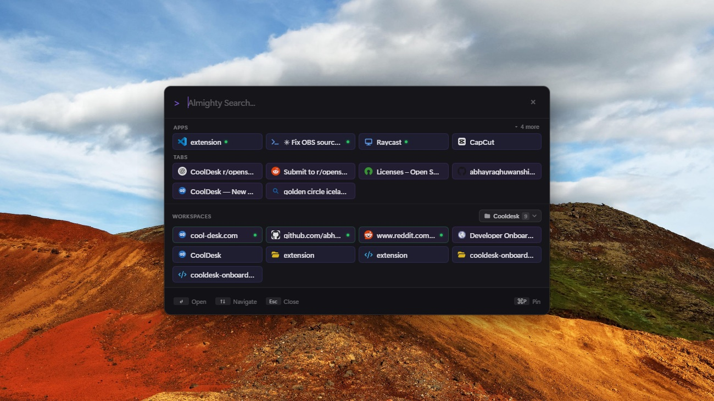
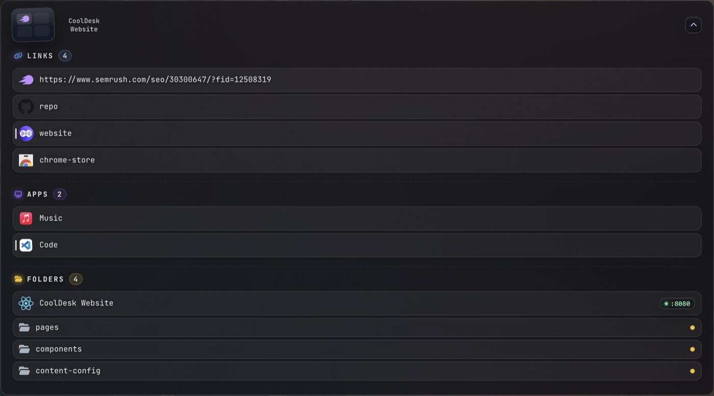
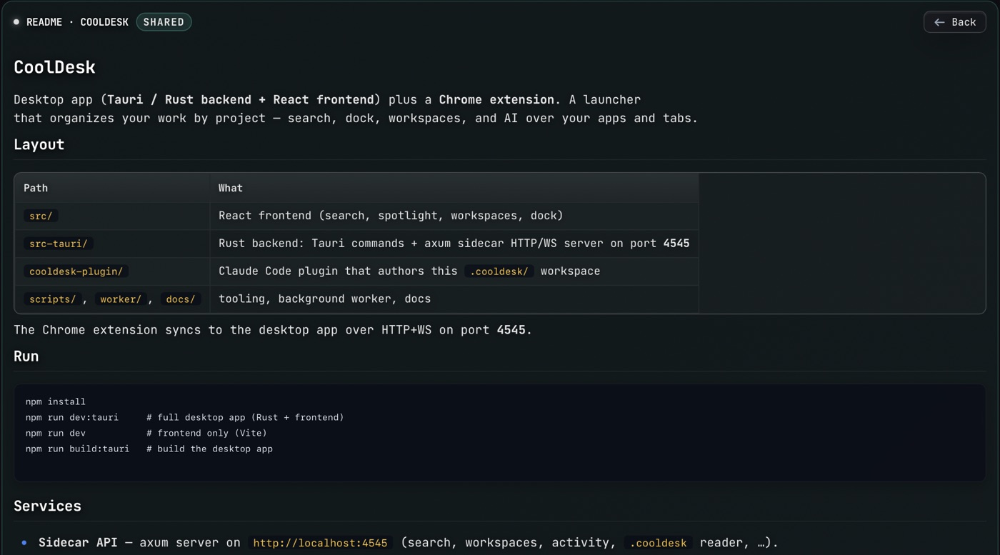
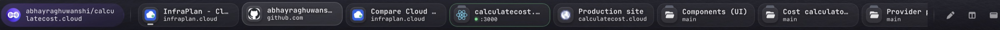
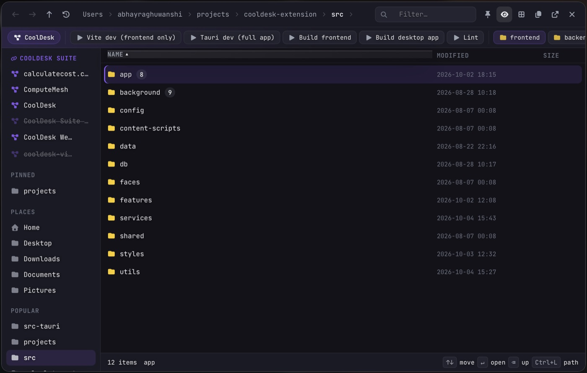
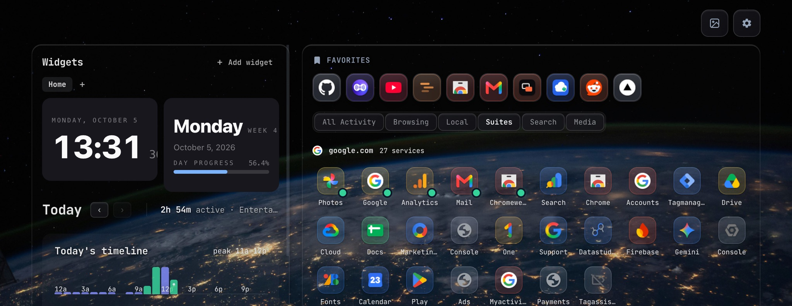

<div align="center">


# CoolDesk

### Don't open apps. Open spaces.

A free, local-first launcher for **Windows, macOS and Linux** that keeps your tabs, apps,
files and notes in **spaces**, one for each project. Press **Alt+K** anywhere and you're back in.

[](https://github.com/abhayraghuwanshi/cooldesk-extension/stargazers)
[](https://github.com/abhayraghuwanshi/cooldesk-extension/releases/latest)
[](https://chromewebstore.google.com/detail/cooldesk/ioggffobciopdddacpclplkeodllhjko)
[](#install)
[](#install)
[](./LICENSE)

**[Website](https://cool-desk.com)** · **[Download](https://github.com/abhayraghuwanshi/cooldesk-extension/releases/latest)** · **[Chrome extension](https://chromewebstore.google.com/detail/cooldesk/ioggffobciopdddacpclplkeodllhjko)** · **[r/cooldesk](https://www.reddit.com/r/cooldesk/)**

<br />



</div>

---

## Why CoolDesk

Your work for one project is scattered across a browser, an editor, a terminal, a few folders and some notes.
Launchers open things one at a time and forget what belongs together. Tab managers stop at the browser.

CoolDesk gives each project a **space** that holds all of it, and one shortcut that finds anything, whether it's
an app, an open tab, a file or a note, and jumps to it if it's already open.

- **Free and open source.** No account, no subscription.
- **Local-first.** Everything stays on your device.
- **Works with what you already use:** VS Code, GitHub, Figma, Linear, Notion, Slack. CoolDesk is a layer on top, not a replacement.

> ⭐ **If CoolDesk saves you time, a star helps other people find it.**

---

## A quick tour

### Spaces: everything for one project

Links, apps and folders in one place. Open items are marked, folders show your **git branch**, **uncommitted
changes** and any **dev server that's running**, and each space keeps its own notes and to-dos.





### Spotlight: one shortcut for everything

**Alt+K** searches installed apps, running windows, open browser tabs, history, bookmarks, spaces and files
together, with fuzzy matching. Picking an open tab or window jumps to it instead of opening a copy.
Type `/` for commands, or `/a`, `/u`, `/f` to search only apps, tabs or files.

### A bar or sidebar beside your work

**Ctrl+Shift+D** (⌘+Shift+D on Mac) switches between a full window, a sidebar on the edge of your screen,
and a bar along the bottom that shows the space you're in.



### A file manager that knows your spaces

Browse any folder without leaving CoolDesk. When it belongs to a space, that space's commands sit on top:
start the dev server or run the build in one click. Keyboard first: ↑↓, Enter, Backspace, Ctrl+L.



### Your new tab, organized too

The free Chrome extension turns every new tab into a dashboard: widgets, your favorite sites, each site's
pages grouped together, and a timeline of where your day went.



---

## Install

### Desktop app

**Windows** (via [winget](https://learn.microsoft.com/windows/package-manager/)):

```powershell
winget install CoolDesk.CoolDesk
```

<a name="macos"></a>
**macOS** (Apple Silicon, via [Homebrew](https://brew.sh)):

```bash
brew tap abhayraghuwanshi/cooldesk https://github.com/abhayraghuwanshi/cooldesk-extension
brew install --cask cooldesk
```

Update later with `brew upgrade --cask cooldesk`.

**macOS / Linux (manual):** download the installer from the
[latest release](https://github.com/abhayraghuwanshi/cooldesk-extension/releases/latest).

### Browser extension

Install **CoolDesk** from the
[Chrome Web Store](https://chromewebstore.google.com/detail/cooldesk/ioggffobciopdddacpclplkeodllhjko).
It also works in Chromium browsers that accept Chrome Web Store extensions, like Edge and Brave.

> 💡 The desktop app and the extension work best together: with both installed, Spotlight can find your
> browser tabs and jump straight to them. They talk over a local port (`4545`) on your machine. Nothing
> goes through a server.

---

## How it works

CoolDesk is two cooperating pieces: a **Tauri desktop app** (Rust + React) and a **Chrome extension**
(React, Manifest V3). They talk over a small local HTTP + WebSocket server on **port 4545**.

```
┌───────────────────────────┐         ┌───────────────────────────┐
│     Chrome extension      │         │    Tauri desktop app      │
│  (React, MV3 service      │         │  (React frontend +        │
│   worker, content scripts)│         │   Rust backend)           │
│                           │  HTTP   │                           │
│  • New-tab dashboard      │◄──────► │  • Spotlight (Alt+K)      │
│  • Tabs / history / marks │   +     │  • Spaces, dock, sidebar  │
│  • Text capture           │   WS    │  • App + window search    │
└───────────────────────────┘  :4545  └───────────────────────────┘
                                  │
                                  ▼
                        ┌──────────────────┐
                        │  axum sidecar    │
                        │  GET /search?q=  │
                        │  WebSocket sync  │
                        └──────────────────┘
```

When you search, the frontend queries the Rust backend (`/search`) **and** the local browser caches
(tabs, spaces, history, bookmarks) **in parallel**, then merges the ranked results. App search runs in
Rust for speed: it reads an in-memory app cache, applies a fuzzy score and boosts running windows.

| Path | What |
| ---- | ---- |
| `src-tauri/src/lib.rs` | Tauri commands, in-memory app cache, dock/sidebar layouts |
| `src-tauri/src/sidecar/` | axum HTTP/WS server on port 4545 (`server.rs` routes, `handlers.rs` incl. `search_apps()`) |
| `src-tauri/src/system.rs`, `focus.rs` | Native window enumeration and cross-platform window focusing |
| `src/features/spotlight/` | The Spotlight UI (`GlobalSpotlight.jsx`) |
| `src/faces/workspace/` | Spaces (called workspaces in the code) |
| `src/features/dock/` | The bottom bar and sidebar |
| `src/features/file-manager/` | The file manager |
| `src/services/searchService.js` | Frontend search: merges Rust results with tabs, history and bookmarks |
| `src/background/`, `src/content-scripts/` | MV3 service worker; text capture and activity tracking |
| `src/db/` | Local persistence and schema validation (`validation.js`) |

---

## Privacy

- **Local-first.** Your spaces, notes and settings live on your device. Nothing is sent to external servers by default.
- **No account needed.** Sync is optional and under your control.
- **User-initiated capture.** Content is saved only when you select text or act.
- **Minimal permissions.** Every Chrome permission is justified in [`docs/permissions.md`](./docs/permissions.md).

---

## Development

**Prerequisites:** [Node.js](https://nodejs.org/) 18+, [Rust](https://rustup.rs/) (stable), and Chrome or another Chromium browser.

```bash
git clone https://github.com/abhayraghuwanshi/cooldesk-extension.git
cd cooldesk-extension
npm install

npm run dev:tauri     # full desktop app (Rust + frontend)
npm run dev           # frontend only (Vite)
npm run build         # production frontend build
npm run build:tauri   # desktop installer
```

**Load the extension:** run `npm run build`, open `chrome://extensions`, turn on **Developer mode**,
click **Load unpacked** and select the project root (it uses `manifest.json`). Open a new tab to see it.

---

## Contributing

Contributions are welcome. For anything substantial, please open an issue first so we can talk it through.
Run `npm run lint` before sending a pull request.

Ideas, bugs and questions: [open an issue](https://github.com/abhayraghuwanshi/cooldesk-extension/issues)
or post in [r/cooldesk](https://www.reddit.com/r/cooldesk/).

---

## License

Licensed under the **Apache License 2.0**. See [LICENSE](./LICENSE).

<div align="center">
<br />

**⭐ Star CoolDesk if it helps you. It's the easiest way to help it grow.**

</div>
